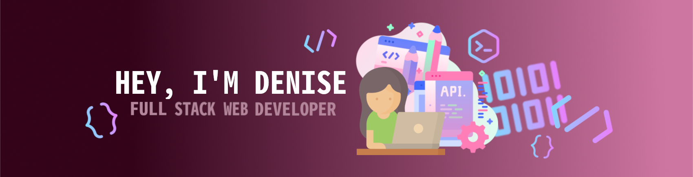

   
  <samp>
  I consider myself a responsible, empathetic person, with the ability to moderate spaces, work as a team and with good communication.  
  I am very creative. 🖌️ 
  This is what got me to where I am right now.  
  I love to design, draw, create things that stand out, perfect them, that are something out of the ordinary, and surprise whoever sees it. 
  When I discovered the incredible wonders that can be created as a programmer, I understood that I had to lean completely towards programming in order to apply what makes me happy.💕 
  My goal is to find new challenges and projects that allow me to apply all my knowledge, continue learning and growing as a programmer. 💻👩‍💻✨ 
   
  </samp>

---------------------------------------------------------------------------------------------------------------------------------------------------------------------------------
 

   <b><i>I am a Full Stack Web Developer, oriented to the Front End.</i></b> 
    
 

  
 

 
---------------------------------------------------------------------------------------------------------------------------------------------------------------------------------

 <b><i> If you like to design or draw like me, we could talk about how cool it is, while we rub elbows together. 😊  </i></b> 
 

  
   

